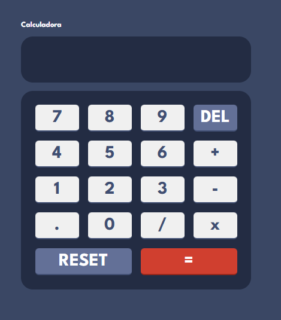
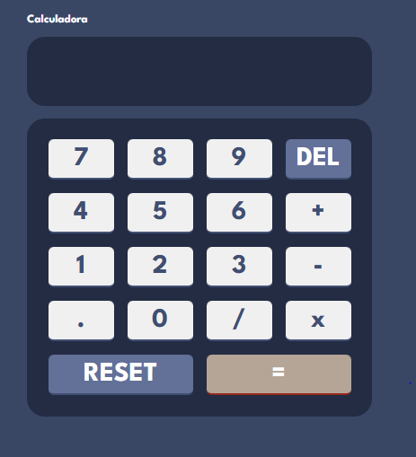
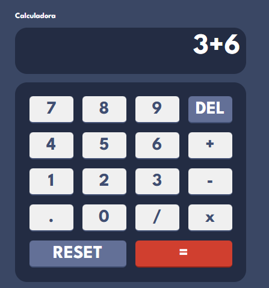

### Calculator App
O objetivo do desafio é desenvolver uma calculadora funcional com funcionalidades matemáticas básicas.

### O que fazer
Realizar operações matemáticas como adição, subtração, multiplicação e divisão

#### Screenshot

##### Calculadora

##### Botao ativo

##### Visualizacao de funcionamento

### Tecnologias Utilizadas
HTML5 semântico
CSS3 customizado
Flexbox e Grid Layout para o layout responsivo
JavaScript para a lógica da calculadora
Google Fonts - League Spartan

### O Que Aprendi
Durante o desenvolvimento deste projeto, aprimorei minhas habilidades em CSS Grid e Flexbox para criar um layout responsivo. Além disso, aprendi como garantir que a calculadora funcione corretamente ao evitar múltiplos operadores consecutivos. Aqui está um trecho de código que destaca essa lógica:

function insert(num) {
    var digitnum = document.getElementById('current-operation').innerHTML;
    var lastChar = digitnum[digitnum.length - 1];

    if (isOperator(lastChar) && isOperator(num)) {
        return;
    }
    
    document.getElementById('current-operation').innerHTML = digitnum + num;
}

### Desenvolvimento Contínuo
Para projetos futuros, pretendo continuar aperfeiçoando a forma como aplico temas e melhorar a acessibilidade, incluindo suporte a teclas de atalho.
Como incluir diferente temas e desenvolver o layout para telas de celulares. 
